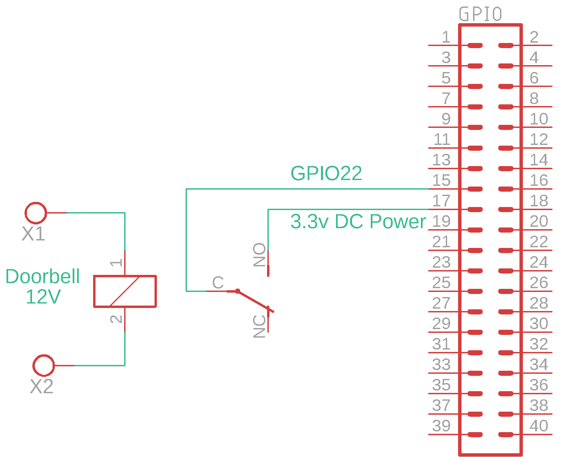

# Telegram doorbell notification running on Raspberry Pi
**This project is based on GreatScott's [Youtube video](https://www.youtube.com/watch?v=ZrkAWSemDC8)** 

In his instance he used WiFi microchip ESP8266 with Arduino code, but I didn't have such a chip, so I got an idea to use relay and connect it's coil to my bell which is powered by 12 volts from transformer and it's normally open leg to Raspberry Pi.

**Table of contents:**
- [Telegram doorbell notification running on Raspberry Pi](#telegram-doorbell-notification-running-on-raspberry-pi)
  * [How to connect relay to your existing doorbell and Raspberry Pi GPIO header scheme](#how-to-connect-relay-to-your-existing-doorbell-and-raspberry-pi-gpio-header-scheme)
  * [How to create Telegram bot](#how-to-create-telegram-bot)
  * [Simple python code that will send message](#simple-python-code-that-will-send-message)
    + [Run python in the background](#run-python-in-the-background)
  * [Troubleshooting](#troubleshooting)
    + [High CPU uasge](#high-cpu-uasge)
    + [I don't have a CHAT ID](#i-dont-have-a-chat-id)
  * [Note](#note)

## How to connect relay to your existing doorbell and Raspberry Pi GPIO header scheme

## How to create Telegram bot
Open Telegram and talk to [@BotFather](https://telegram.me/BotFather "BotFather"). Send `/newbot` to him and follow his prompts. In response you will get an HTTP API token.

*API Example:* `123456:ABC-DEF1234ghIkl-zyx57W2v1u123ew11`

Next open your bot conversation `t.me/<bot_username>` and /start your newly created bot and then immediately open `https://api.telegram.org/bot<token>/getUpdates` in your web-browser.

*URL Example:* `https://api.telegram.org/bot123456:ABC-DEF1234ghIkl-zyx57W2v1u123ew11/getUpdates`

Copy the chat id from the returned JSON object. 
`"chat":{"id":123456789,`

*CHAT ID Example:* `123456789`

## Simple python code that will send message
In code below you have to change your **token** and **chat id** and based on your Raspberry Pi GPIO pins usage, you can change var **PIN** to your preferable pin.
(In my instance I used pins close to each other: for 3.3v - pin 17 and for monitoring - pin 15(GPIO22). [GPIO HEADER PINOUT](img/gpiopins.png)

[Python code](bellNotifier.py)

[Python code with ring timestamp](bellNotifierWithTimestamp.py) 

### Run python in the background
To let code running in the background, I'm using nohup and output will append to bell.log file.
```shell
nohup python3 -u ./bellNotifier.py >> bell.log &
```
## Troubleshooting
### High CPU uasge
Simply change sleep time in while loop.
> Be aware that high time sleep may put program into sleep while someone could ring.

```python
try:
        state = GPIO.input(PIN)
        if state:
            requests.post(SEND_URL, json={'chat_id': CHAT_ID, 'text': "Door Bell!!!"})
            time.sleep(2)
        time.sleep(0.4) #THIS TIME (in seconds)
```
### I don't have a CHAT ID
To get the chat id, last message in the chat must be sent by you, not by the bot. Just send some gibberish and refresh page.
## Note
If you would like to improve my code or edit something, create an Issue and I will look at it. (maybe)
